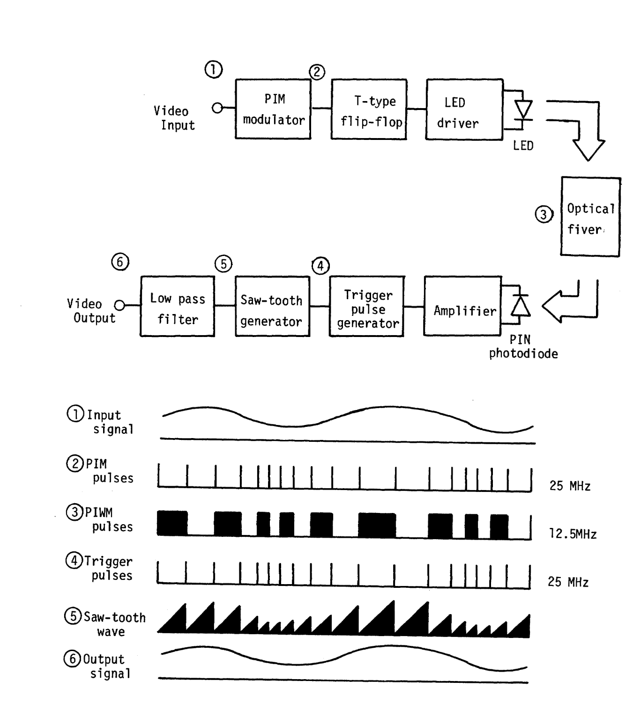
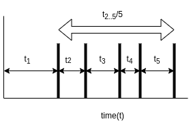

# Introduction

The ability to perform accurate repetitive computation has been central
to numerous scientific and technological advances in the last seventy
years. At the heart of this is Moore's Law
[@Moore:2000:CMC:333067.333074], which states that computational power
provided by the silicon based Central Processing Units (CPUs) will
double year-on-year for the foreseeable future. Unfortunately, several
factors have compounded to make this less likely to continue: heat
dissipation, atomic and quantum effects provide practical limits to the
miniaturisation and packing of transistors [@moorefail], and the limited
bandwidth between CPU and memory limits computation speed (the
von-Neumann bottleneck [@Backus:1978:PLV:359576.359579]). There is also
doubt about fabrication processes working below 3nm, although many
vendors are issuing in even more miniaturisation which they refer to as
the angstrom era (see Figure [1](#fig:intel){reference-type="ref"
reference="fig:intel"}).

<figure id="fig:intel" data-latex-placement="ht">

<figcaption>Predicted physical gate size decline over the next five
years. Credit: <a href="https://doi.org/10.1098/rsta.2019.0061/"
class="uri">https://doi.org/10.1098/rsta.2019.0061/</a></figcaption>
</figure>

At the same time, methods of data processing using learning systems have
become significant new architectural components. Of these, Deep Learning
(DL) [@lecun2015deep] has provided best-in-class performance on many
machine learning tasks, and revitalised many areas of pattern
recognition, opening up a revolution in new services that were
traditionally performed using human intensive processes. Moreover, these
methods are not well supported by traditional computer architectures
[@JEON2021167] as they require massive parallelism, similarly to the
brain. Graphics Processing Units (GPUs) , initially built for video
games, have been successfully utilised, but still suffer from high
levels of inefficiencies which are many orders of magnitude away from
biological systems in energy and ability.

Given this impasse, there is a need to look more broadly at the problem
of improving the efficiency **and** accelerating computation. This has
resulted in a "Cambrian explosion" [@hennessy2019new] of new approaches,
and this research focuses on one of these, **temporal computing**.

This new approach represents numbers with a unary encoding (discussed in
more detail in Section [3](#unary){reference-type="ref"
reference="unary"}) instead of binary, and uses *time delays* to
represent data instead of digital bit manipulation. We are drawn to this
area for several reasons.

1.  There is a precedence in nature, the human brain uses spike-based
    information as the main processing encoding [@victor2000brain].

2.  Unary is more simplistic than binary to compute with. Tools such as
    the abacus are among the earliest calculators [@POPPELBAUM198747].

3.  On the surface, time appears to be a free resource. For a typically
    coded temporal interval, the is only ever a requirement for two
    delimiting spikes (See Figure [2](#fig:two){reference-type="ref"
    reference="fig:two"} ) [@smith2022temporal].

<figure id="fig:two" data-latex-placement="ht">

<figcaption>A typical value can be represented as two delimiting
spikes.</figcaption>
</figure>

The three capabilities detailed above provide a broad definition of an
area of research, but this is yet to be established in the mainstream.
Four areas: racelogic, unary processing, oscillatory Computing and
neuromorphic compute, utilise time as a medium but do so without
explicitly exploiting the above features. This is particularly the case
with two areas under review, neuromorphic and oscillatory computing,
with methods in these areas often conflating the benefits of hardware
and problem specific algorithmic approaches.

The problem of defining temporal computing is further compounded by
misuse of the term "stochastic" eg in works
[@wu2020ugemm; @wu2023power], and significant oversight in not including
previous work from the late sixties on unary compute
[@POPPELBAUM198747], in discussions.

With this in mind, the agenda of this report is:

- To cover all research specifically referenced as "temporal" by the
  racelogic community (section [2](#race){reference-type="ref"
  reference="race"}).

- To also include older work on Unary computing including work referred
  to as temporal/unary but which also could be defined as stochastic.
  (section [3](#unary){reference-type="ref" reference="unary"}).

- To also include communication methods that use similar interval
  encodings and have processing approaches that may be repurposed to
  compute (Section [4](#coms){reference-type="ref" reference="coms"}).

- For completeness, include both oscillatory and neuromorphic computing
  in the discussion (Sections [5](#oscil){reference-type="ref"
  reference="oscil"} and [6](#neuro){reference-type="ref"
  reference="neuro"})

This nicely sets the agenda for future work which we define as a mission
with a plan and milestones (See separate planning document).

# Racelogic {#race}

Racelogic is undoubtedly the most significant area of research in the
temporal domain, both computation and memory, and has formed a small
community in the US [@madhavan2014race].

The central theme of this work is the utilisation of the two timing
properties of traditional logic gates. Under a temporal scheme an `AND`
gate acts as a `MAX` operation, and the `OR` gate acts as a `MIN`
operation (see Figure [3](#fig:race){reference-type="ref"
reference="fig:race"}).

<figure id="fig:race" data-latex-placement="ht">

 

<figcaption>A visual explanation of racelogic. The first diagram shows
the representation and second gives the “race” min/max
effect</figcaption>
</figure>

Using this a variety of systems have been proposed and implemented
[@madhavan2014race], most notably to perform minimum and maximum path
search on a graph [@madhavan2015race].

This work has been extended to utilise a tropical algebra
[@madhavan2021temporal] a semi-ring that implements multiplication and
addition, and this was referred to as a Temporal State Machine. Under
this scheme various additional graph algorithms including Dikstra's were
implemented and benchmarked.

Further work by this group also involved building temporal memories
called *Racetracks* [@vakili2020temporal; @madhavan2020storing]. The
basis of this is akin to dragging a bucket for a set distance, the time
to do this becomes fixed for a set bucket size (see Figure
[4](#fig:racetrack){reference-type="ref" reference="fig:racetrack"}). In
this work this is implemented on a magnetic platform, with the addition
of a recovery track to reset the memory. This is the first known
implementation of memory and the "dragging time" approach seems to be
something that could be readily applied in many resistive physical
mediums.

<figure id="fig:racetrack" data-latex-placement="ht">

<figcaption>The racetrack memory operations. Taken from </figcaption>
</figure>

The logic gate processing format has also been explored by two further
parties, in the context of superconducting mediums
[@tzimpragos2019arbitrary] [@tzimpragos2021temporal]
[@tzimpragos2022computing] [@volk2023addressable] [@segal2022digital]
also as a formulation for a specific supporting algebra. The
superconducting work follows a similar pattern and is limited to a
constrained view of logic operations applied to temporally organised
inputs. This work is excellent proof-of-concept work, but lacks
reference to comparable digital algorithms and the nature of space/time
trade-offs.

# Unary Computation {#unary}

Unary number systems ([@MacKay:2002:ITI:971143] Chapter 7 page 133) were
amongst the earliest numerical representations of quantity, with the
abacus existing as the earliest calculating device [@POPPELBAUM198747].
Unary codes are a simplification, with either binary digit acting as the
delimiter. Table [1](#mem1){reference-type="ref" reference="mem1"} gives
a breakdown of how unary codes are constructed for the first few decimal
numbers. We introduce a further code Discrete Pulse Interval Modulation
(DPIM), which is a form of unary code, and is used in the communication
community and is discussed in Section [4](#coms){reference-type="ref"
reference="coms"}.

:::: center
::: {#mem1}
    **Decimal** Unary (U)   Unary code (UC)     DPIM
  ------------- ----------- ------------------- --------------------
          **0**             \(0\) may delimit   \(11\) may delimit
          **1** 1           1                   101
          **2** 11          10                  1001
          **3** 111         100                 10001

  : Coding Schemes related to Temporal Computing
:::
::::

One of the key benefits for all the unary family is that simple
arithmetic is easily derived: Addition with unary, as with the abacus,
is performed trivially using simple concatenation [@jonny1].

Integer multiplication of unary codes is performed by dilating the first
unary code by the size of the second code. In a fully clock based
architecture this can be performed by changing the relative clock speeds
of the sender and receiver of the signal (see [@jonny1] section 3.3 for
a more detailed explanation) Again, this is a simple operation which
requires only basic logic to perform.

The review paper of Poppelbaum [@POPPELBAUM198747] explains in some
detail first-generation unary computers. There are three types of unary
processing: stochastic, burst and pulse gear based approaches. These
systems can be summarised as follows:

Stochastic

:   where the unary value represents a discrete probabilistic range,
    sometimes with randomness incorporated. Many machines have been
    built with this premise, including **RASCEL** [@esch1969rascel]
    **POSTCOMP** [@poppelbaum1967stochastic]. This continues to be an
    active field of research [@alaghi2013survey].

Burst

:   This is more akin to traditional unary but with a specific
    bit-width, so for instance 7 out of 10 bits set (`1111111000`) would
    equal 7. Examples of it's use are **BURST** [@POPPELBAUM198747] and
    **WALSHSTORE** [@bracha1978walshstore].

Pulse Gear

:   This again uses burst unary but provides a clever method for
    shifting and ANDing to perform operations. An example of this is the
    **UNIFIELD** processor [@dollas1987architecture].

These largely forgotten systems are all very interesting applications of
unary and could be utilised in the design of new processing elements,
the Pulse Gear methods, and the use of AND gates and counters have some
resonance with methods discussed later in this review.

Two further points should be noted. Firstly, none of these systems use
the benefits of redundancy and the delimiting nature of unary codes and
are firmly wedded to using many boolean `on` (`1`'s) values. Secondly
they are explicitly non-temporal, this means that time is not used to
represent data.

More modern work in this area has been performed by Wu [@wu2020ugemm]
[@pan2022t] [@wu2022usystolic]. This work is again mainly unary and
again not explicitly temporal.

## Multiplexed Unary

**Unary codes** have an additional property that a set of non-duplicate
values can be efficiently multiplexed. Again to use the abacus analogy,
if we have beads of two colours: black ($1$) and white ($0$), provided
there is no duplication, multiplexing can occur which *reuses white
beads*. Again, the logic of this is a simple `OR`ing of the value from a
start reference bit. Figure [5](#fig:mul1){reference-type="ref"
reference="fig:mul1"} presents this graphically. This system is
*genuinely* multiplexing; the two values are overlaid so the values
actually forms part of the subsequent data. This is unique to this
coding strategy and is unlike any other system of multiplexing. The
general algorithm for conversion to this multiplexed domain is as
follows:

{#fig:mul1
width="100pt"}

::: algorithm
:::

Once transformed, signals can be interleaved in such a way that they can
be easily recovered. To de-multiplex, the process is reversed, with the
MUX channel progressively reconstructs the input values back into
separate channels.

::: algorithm
Write I into output channel;
:::

A natural extension is to enable the unary coded $1$ value to be
multi-valent. Although at first this may appear contrived, the
motivation for this is the extension of the multiplexing method to
incorporate duplicates, and the ability to better encode analog interval
channels. This channel also has an additional property that
multiplication can be performed, at least within the bounds of the
notation, by placing a value $a$ at position $t$, and *also*
multiplexing as in Figure [6](#fig:multiply){reference-type="ref"
reference="fig:multiply"}.

<figure id="fig:multiply" data-latex-placement="ht">

<figcaption>Multi-valent multiplexing for a potential analog
implementation</figcaption>
</figure>

Although not immediately obvious, an uncertainty relationship exists
between position and data when "dense" multiplexing is used. To
illustrate this let us take the trivial sequence (1,3,2) with knowledge
of the prior this could be easily transformed into the densely
multiplexed representation of (111) [^1] which notionally can be
represented with a smaller number of bits, but with a loss of order in
the data. Adding positional values via a positional index recovers from
the problem but at the cost of extra data, with a different prior
distribution.

Clearly, the act of multiplication can be transformed into manipulating
the values held in the buckets. This can be easily extended to a
dot-product operation and the representation of tuple pairs is somewhat
compressive since one element of the 2-tuple is specified by a
positional index.

Under a simple scheme, tuples can be added arbitrarily to the array at
their $t$ index point. A dot product on this multiplexed array can be
evaluated efficiently and in a systolic way using the **Multiplicative
ADD** (MADD) algorithm (Algorithm [\[madd\]](#madd){reference-type="ref"
reference="madd"}) as shown in [@jonny-asynch]. Figure
[7](#fig:madd){reference-type="ref" reference="fig:madd"} demonstrates
that the algorithm is effectively finding the area of the rectangles
$4 \times 10$ and $4 \times 4$ by progressively sweeping in one pass
back across the indexed array, counting initially the first $6 \times 4$
and then the remaining $8 \times 4$.

::: algorithm
$acc,height \gets 0$ $i \gets |mem|-1$ **return** acc
:::

<figure id="fig:madd" data-latex-placement="ht">

<figcaption>MADD: A description based on a goemetric view of the MADD
algorithm. Here we perform the operation (4 × 10) + (4 × 4) right to left by
accumulating the "height" at the index point</figcaption>
</figure>

The MADD algorithm originated from the use of discrete memory indexes as
a simulation of time delays. As such the MADD algorithm is inspired by
the temporal approach, but, its representation does not use time delays
directly as the storage medium. Appendix
[\[app:dmadd\]](#app:dmadd){reference-type="ref" reference="app:dmadd"}
discusses an extension to this method, called Delta MADD.

# Temporal/Unary for Communication {#coms}

Interval codes have been exploited in the communication community in the
form of DPIM [@Das1967PulseintervalM], where the pulses delimit both the
beginning and end of the encoded value. This method was heavily
researched from the late sixties onwards [@marougi1983signal]
[@kaluarachchi1997digital] [@sato1978pulse] and revisited by the optical
community during the nineties [@ghassemlooy1998digital]
[@ghassemlooy2000digital]. The scheme is very simple, and efficient in
terms of the sparsity of the representation, with two spikes being able
to represent any magnitude.

There are several further compelling advantages:

Bandwidth Efficiency

:   DPIM is more bandwidth-efficient than some other modulation schemes.
    This is because it doesn't require changes in amplitude or pulse
    width, which can demand more bandwidth.

Power Efficiency

:   Since DPIM doesn't rely on varying amplitude, it can be more
    power-efficient. Ghassemlooy states:

    > For the same packet error performance, 4-bit DPIM has about a 5dB
    > power advantage over OOK, but requires approximately 1dB more
    > power than 4-bit PPM [@ghassemlooy2000digital].

    OOK is traditional bit encoding and PPM is Pulse Position Modulation
    (the same as DPIM but with a constant bit-width, hence pulses are
    not self-delimiting).

Suitability for Optical Communication

:   DPIM is often used in optical communication systems because it can
    be implemented as light pulses.

Simplicity

:   The circuitry for DPIM can be simpler than other modulation schemes,
    as it only needs to control the timing of pulses.

However, there has been a lack of adoption based on the following
disadvantages:

Synchronization Complexity

:   One of the main challenges of DPIM is the requirement for precise
    synchronization between the transmitter and receiver. As with all
    temporal systems encoding and decoding require a very stable and
    accurate clock, which can add complexity and cost to the system.

Limited Data Rate

:   While DPIM can accommodate variable data rates, the practical data
    rate might be limited by the precision of the timing measurements.

Error Propagation

:   In some implementations of DPIM, errors in detecting one pulse
    interval can propagate and affect the detection of subsequent
    intervals.

One point to note that affects how we might process temporal intervals
in a computational setting is the use of ramp functions
[@sato1978pulse]. A **ramp function**, also known as a saw-tooth wave or
ramp waveform, is a type of signal where the voltage or current
increases linearly with time, then abruptly drops back to its starting
value, and repeats this cycle periodically. Figure
[8](#fig:pim){reference-type="ref" reference="fig:pim"} gives a typical
view of communication system using ramp functions to DPIM encoded data.

<figure id="fig:pim" data-latex-placement="ht">

<figcaption>A communication system using ramps to encode and decode
data. Taken from </figcaption>
</figure>

DPIM has served as inspiration for many studies of neural information
encoding in Neuroscience [@meister1999neural] [@rieke1995naturalistic]
[@borst1999information], Mackay's work [@MacKay1952] focused on the
channel capacity of this simple model, and surprisingly they find that
for a suitable set of constraints, time encoding outperforms single bit
based information encoding.

# Oscillatory Systems {#oscil}

An oscillatory computer utilises the dynamics of time-based coupled
oscillators to perform computation.

Coupled Oscillators are a technique in non-linear dynamics that produce
stable and predictable patterns of oscillation from the ensemble
behaviours of many oscillators [@strogatz2001nonlinear]. The classic
example of this is the firefly synchronisation problem
[@buck1988synchronous] where fireflies in a forest synchronise their
flashing patterns.

Unlike traditional computers, oscillatory computers encode and process
information using the phase, frequency, or amplitude of oscillations.
This approach is inspired by the observation that many biological
systems, including the brain, use oscillatory dynamics for information
processing and communication. For a review article and example see
[@csaba2020coupled] and [@csaba2018perspectives]. Example systems
include [@ring] [@delacour2021oscillatory] [@delacour2023mixed]
[@corti2021networks] [@frady2019robust] [@maher2024highly].

The advantages of oscillatory computers include:

- Parallelism through the emerging dynamics of coupling.

- Energy Efficiency as they often rely on the natural dynamics of
  physical systems.

- Robustness to noise and variability, due to the collective dynamics of
  coupled oscillators.

{#fig:fig2 width="200pt"}

Some of challenges associated with oscillatory computers include:

Precision

:   The precision of computations in oscillatory computers may be
    limited by the inherent variability and noise in the oscillatory
    dynamics.

Programmability

:   Programming oscillatory computers can be difficult, as it requires
    the control of the complex dynamics of the coupling.

Scalability

:   Scaling up oscillatory computers to large numbers of oscillators can
    be difficult, as the dynamics can become increasingly complex and
    hard to control.

Interfacing

:   as with many systems discussed in this document interfacing with
    traditional digital systems is problematic, with similar problems to
    analog to digital conversion.

# Spiking Neural Networks and Neuromorphic Compute {#neuro}

Spiking Neural Networks (SNNs) [@maass2001pulsed] are a type of
artificial neural network that more closely mimic the behavior of
biological neural networks. SNNs are a key component of neuromorphic
computing, which aims to develop hardware and software systems that
mimic the structure and function of biological neural networks. This is
extensive literature on neuromorphic hardware platforms, such as
SpiNNaker [@furber2016large; @furber2014spinnaker], TrueNorth
[@sawada2016truenorth], Loihi [@davies2018loihi], and BrainScale
[@schmitt2017neuromorphic]. These platforms are optimized for low-power,
real-time operation often outperforming their DL cousins in terms of
energy usage [@reuther20], but at the cost of conjoined hardware and
software offerings.

SNNs are explicitly temporal using spikes to define data, their key
aspects are:

Information Encoding

:   There are a variety of coding schemes, not just the "width" encoding
    discussed in this document. These are:

    Rate Coding

    :   Information is encoded in the average firing rate of neurons,
        similar to traditional ANNs.

    Temporal Coding

    :   Information is encoded in the precise timing of individual
        spikes. This can include schemes like Time to First Spike (TTFS)
        or Rank Order Coding (ROC).

    Population Coding

    :   Information is encoded in the collective activity of a group of
        neurons.

    See appendix [8](#app:brain){reference-type="ref"
    reference="app:brain"} for further discussion.

Neuron Models

:   SNNs use more biologically plausible activation functions than ANNs.
    Some commonly used ones are:

    Integrate-and-Fire (IF) Neurons

    :   [@burkitt2006review] IF neurons integrate incoming spikes and
        fire an output spike when a threshold is reached. After firing,
        the neuron's membrane potential is reset.

    Leaky Integrate-and-Fire (LIF) Neurons

    :   [@tal1997computing] LIF neurons are similar to IF neurons but
        include a leakage term that causes the membrane potential to
        decay over time.

    Hodgkin-Huxley Neurons

    :   [@y2003computation] The Hodgkin-Huxley model is a detailed
        biophysical model that describes the dynamics of ion channels in
        the neuron membrane.

Synaptic Models

:   In SNNs, synapses can have dynamic behaviors, unlike the static
    weights used in traditional ANNs. This gives rise to a
    computationally richer and more compact pattern processing systems.

One of the most relevant applications of this idea is the work done by
Hopfield [@hopfield1995pattern]. Hopfield's key insight was that the
correct representation is the key to solving difficult problems:

> The choice of information representation is of vital importance in
> making a computation easy, as is illustrated by the question 'is
> 3630225 divisible by 7?'. If the number 3630225 is in base 10,
> answering this takes a bit of work. If the number 3630225 is in base
> 7, the answer is immediate from inspection of the last digit. The
> choice of representation for analogue information is equally important
> for neural computation. [@hopfield1995pattern]

The main focus of this work is to mimic the behaviour of the olfactory
system. This particular problem is termed the "analog match" problems,
and whilst solvable via traditional logistic methods is more robust when
recast as a coincidence problem. Figure
[10](#fig:carlos){reference-type="ref" reference="fig:carlos"} shows how
the system functions, note that the data is log scaled.

![Computing with Action Potentials, taken from
[@hopfield1995pattern]](figures/carlos.png){#fig:carlos width="300pt"}

# Critique and Next Steps

The document provides an overview of four emerging areas in computing:
race logic, unary, oscillator, and neuromorphic. Each area presents
unique challenges and opportunities for advancement in computational
technology. To summarise the key points:

Racelogic

:   is a practical and promising approach for utilising temporal data in
    computing. It's highlighted as one of the first methods to
    effectively a *truly* temporal approach. Also, the work on temporal
    memories, significantly strengthens the case for this technology,
    and racelogic has already explored wide-ranging applications. Its
    scope in terms of arithmetic and compute based operations is
    currently limited to a few comparison operations, and hence there is
    a lack of insight into utilising race logic as a general-purpose
    computer.

Unary Computing

:   Despite extensive past research, unary computing has been largely
    overlooked in recent years. It holds potential for reevaluation in
    light of advancements in AI and complex computing systems. The
    primary challenge lies in its memory footprint, as traditional
    memory doesn't scale well for unary representations. However, true
    temporal systems, ones which use time as data directly, are an
    avenue to alleviate this problem. Future research opportunities also
    include exploring unary signals with non-linear representations,
    which increase the efficiency of the subsequent computation.

Oscillatory Computing

:   Oscillator computing shows significant promise, with potential for
    high-speed operations in the range of 50-100 GHz. This technology
    could potentially offer a 10x improvement over current computing
    capabilities, however seems to be applicable to specialist problems
    rather than general compute.

Neuromorphic Computing

:   is the most mature technology among those reviewed. However, it is
    perhaps too literal in mimicking brain functionality, which may
    limit its potential. Our view is that time-based approaches should
    be emphasised over biological plausibility the analogy we draw is
    that of aircraft design, which draws inspiration from birds flight
    but in no way mimics the wing-flapping approach.

In conclusion, while each area reviewed above faces unique challenges,
they all offer promising avenues for future research and development.
Therefore the aim of the future work to conducted as a part of this PhD
study is to perform some realistic practical assessments on example
temporal systems in terms of key performance indicators. The scope of
this work will initially focus solely on the more general version of
temporal processing applied to neurally inspired architectures, since
this is the most important opportunity.

# Time Coding in the Human Brain {#app:brain}

The following section describes the major encoding methods utilised by
the brain. This serves as background to the biological inspiration of
the temporal coding strategy [@victor2000brain].

<figure id="fig:rate" data-latex-placement="ht">

<figcaption>Rate and Time-to-first-spike Coding</figcaption>
</figure>

Rate coding is the "standard" scheme for modelling neural signals
computational [@rosenblatt1958perceptron]. The term is self-explanatory
it is a count of the rate by which spikes arrive at a computational unit
(see Figure [11](#fig:rate){reference-type="ref" reference="fig:rate"}).
Averaging is robust and easy to model as a scalar value on traditional
computers, however some questions exist as to whether a more immediate
response is required from a (potentially threatening) stimulus, hence
investigations into temporal and time to first spike encodings.

## Spike Timings

In contrast to rate coding interval or spike coding utilises the exact
time between two spikes as the magnitude of the signal. This model was
first mentioned in the work of MacKay and McCullough [@MacKay1952] who
focused on the channel rate of this simple model. Surprisingly, with
neuron specific measurements, a maximum selective information capacity
of about 2.9bit/msec is produced as opposed to 1bit/msec from a simple
single-bit based encoding over a channel, where Information capacity
($C$ in bits/time) is given by:

$$C=\frac{2}{\Delta T(m+ r)} log_2(m- r)$$

where $\Delta T$ is the time resolution, $m=(T_m-T_r)/\Delta T$
approximately the range of data, and $r=\frac{T_r}{\Delta T}$ a lower
bound.

# Encoding in Stochastic and Probabilistic Computing

In stochastic computing, encoding is performed using random bitstreams
where the proportion of 1s represents a numerical value. This is
typically done using either **unipolar** or **bipolar** encoding
schemes. Unipolar Encoding represents values in the range $[0, 1]$. A
number $x$ is encoded as a bitstream where the probability of a 1 is
$x$. For example, a value of $0.75$ might be encoded as a bitstream like
`1101111011111011`, which contains approximately $75\%$ 1s. A Bipolar
Encoding Represents values in the range $[-1, +1]$. A value $x$ is
encoded with the probability of a 1 as $(x + 1)/2$. For example, a value
of $-0.5$ would be encoded with a bitstream containing approximately
$25\%$ 1s.

# Advantages

- **Simplified arithmetic:** Multiplication becomes a simple AND gate
  (unipolar) or XNOR gate (bipolar).

- **Fault tolerance:** Randomness makes systems robust to noise and bit
  flips.

- **Low hardware cost:** Uses simple logic gates instead of full
  arithmetic units.

# Example: Unipolar Multiplication

To multiply $0.5 \times 0.75$:

- Encode $0.5$ as a bitstream with $50\%$ 1s.

- Encode $0.75$ as a bitstream with $75\%$ 1s.

- AND the streams to get a result with approximately $37.5\%$ 1s,
  representing $0.375$.

# Challenges

- **Accuracy:** Requires long bitstreams for precision.

- **Latency:** Longer streams mean slower computation.

- **Correlation:** Input streams must be uncorrelated to avoid bias.

A **p-bit** (probabilistic bit) is a classical binary unit that
fluctuates randomly between $+1$ and $-1$ with a tunable probability.
Unlike deterministic bits, p-bits are inherently stochastic and can be
biased toward one state or the other using an input signal
[@camsari2017stochastic].

# Mathematical Model

The state $m_i$ of a p-bit is given by:

$$\begin{equation}
    m_i(t) = +/- [\tanh(I_i(t)) + r(t)]
\end{equation}$$ where:

- $I_i(t)$ is the input bias at time $t$

- $r(t)$ is a random number uniformly distributed in $[-1, 1]$

- $+/-$ is the sign function

# Key Properties

- **Tunable randomness:** The probability of outputting $+1$ or $-1$
  depends on the input bias.

- **Autonomous flipping:** P-bits update asynchronously and
  independently [@camsari2019petaflips].

- **Energy-efficient:** Can be implemented using low-power devices like
  stochastic magnetic tunnel junctions (sMTJs) [@camsari2023fullstack].

# Comparison to Stochastic Computing

While both p-bits and stochastic computing rely on randomness, p-bits
Operate on single fluctuating bits rather than long bitstreams, and
allow dynamic tuning of probability via input bias. They are better
suited for asynchronous, parallel architectures.

# MeTTa: A Reflective Meta-Language for AGI

MeTTa (Meta-Type Talk) [@goertzel2021metagraph]
[@singularitynet2024mett] is the foundational programming language of
OpenCog Hyperon [@opencogHyperon], designed to support Artificial
General Intelligence (AGI) through symbolic reasoning, introspection,
and self-modifying code. It serves as a meta-language capable of
defining and manipulating other languages and type systems.

## Core Features

Reflective Metagraph Rewriting, Programs are represented as
metagraphs---graphs of graphs---enabling recursive transformations and
dynamic reasoning. MeTTa uses powerful pattern-matching and substitution
primitives to infer and rewrite expressions. The language is
syntactically sparse, allowing users to define custom logics and type
systems. Grounding Support: Symbolic atoms can be linked to sensory or
motor data, enabling embodied cognition. MeTTa programs can inspect and
alter their own structure, supporting recursive self-improvement.

MeTTa operates as the lowest-level cognitive substrate in OpenCog
Hyperon. It interfaces with the Distributed Atomspace (DAS),
orchestrating reasoning, learning, and control. It replaces Atomese from
OpenCog Classic with a more flexible and semantically rich alternative.

# Applications {#applications .unnumbered}

- Symbolic reasoning and logic programming

- Cognitive architecture modeling

- AGI-oriented introspection and learning

MeTTa, the meta-language of OpenCog Hyperon, supports probabilistic
reasoning by enabling symbolic manipulation of uncertain knowledge
through pattern rewriting and weighted truth values. Unlike traditional
probabilistic programming languages that rely on explicit probability
distributions, MeTTa operates over a hypergraph-based memory structure
(the Distributed Atomspace), where each atom may carry a *truth
value*---a pair representing strength and confidence.

Probabilistic inference in MeTTa emerges from the interaction of three
key mechanisms: (1) pattern matching over uncertain structures, (2)
rule-based rewriting conditioned on probabilistic thresholds, and (3)
recursive self-modification of inference strategies. These mechanisms
allow MeTTa to encode Bayesian-like updates, fuzzy logic, and stochastic
search within a unified symbolic substrate.

Rather than treating probability as a separate computational layer,
MeTTa integrates it into the fabric of cognitive processes. For example,
attention allocation, memory retrieval, and goal selection can all be
guided by probabilistic heuristics encoded as MeTTa rules. This enables
AGI systems to reason under uncertainty, adaptively revise beliefs, and
simulate human-like cognition.

# Probabilistic Reasoning Example in MeTTa

# Problem

Decide whether to carry an umbrella based on the probability of rain. If
the probability exceeds 0.6, the system recommends carrying an umbrella.

# MeTTa-Like Representation

    ;; Define a probabilistic belief
    (Probability (RainToday) 0.75)

    ;; Rule: If rain probability exceeds threshold, recommend umbrella
    (If
      (GreaterThan (Probability (RainToday)) 0.6)
      (Then (Action CarryUmbrella))
    )

# Rewrite Logic

    ;; Pattern to match
    (Probability ?event ?p)
    (GreaterThan ?p 0.6)

    ;; Rewrite result
    (Action CarryUmbrella)

# Truth Value Representation

In OpenCog Hyperon, atoms may carry truth values as pairs of strength
and confidence:

    (RainToday)
    :TruthValue (Strength 0.75) (Confidence 0.9)

# Interpretation {#interpretation .unnumbered}

This structure allows MeTTa to reason symbolically over uncertain inputs
and take action based on probabilistic thresholds. The system can
generalize this logic to other decisions involving uncertainty.

[^1]: 1=1,2=01,3=001
